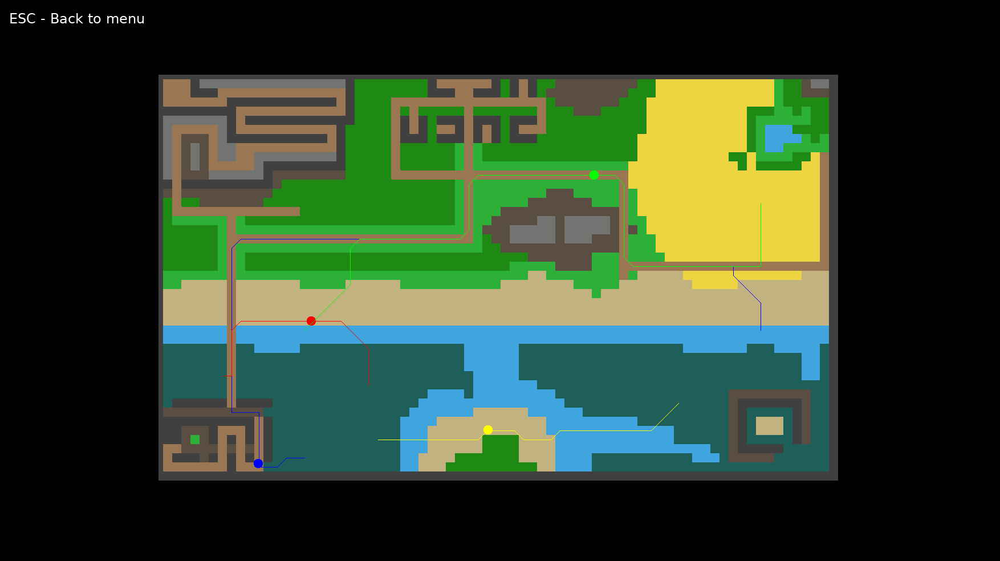
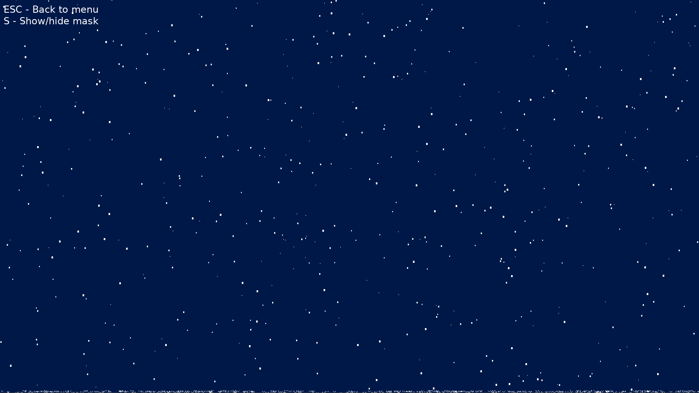
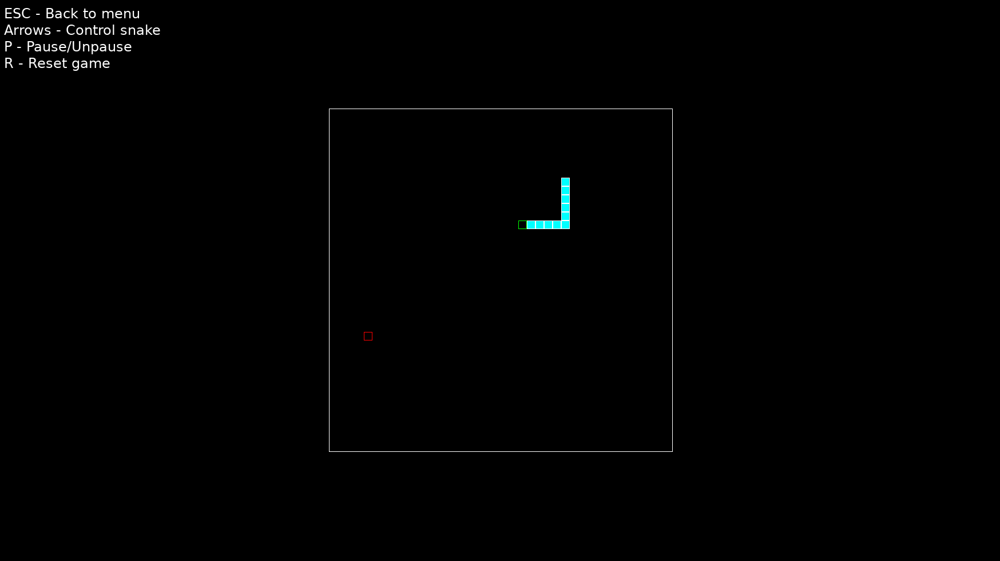
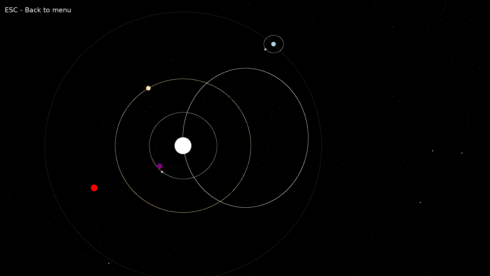
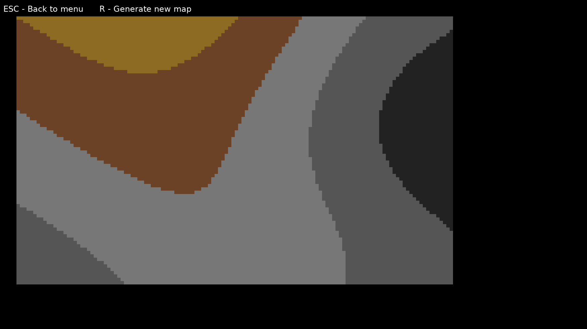
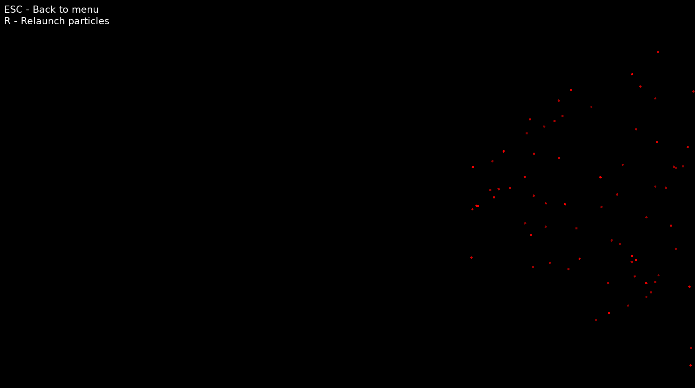

# Generic demos program

This program has suffered a lot of changes, reworks, rewrites, and more, after all it is the project I use to test new things.
The last of which added, perhaps, the most interesting element, an Entity-Component-System(ECS) system, similar to the system used in unity3d.
The ECS system appeared when I was working on the [sdl_gui project](https://github.com/N4G170/sdl_gui). When I started having new ideas on how to make sdl_gui easier to use, I noticed I was moving in the direction of an ECS system.
The new system is not perfect, it needs more polish and features, but currently, it makes the creation of new demos a lot easier and cleaner.
With new new system, I scrapped my old parent-children transform system, as the new one is cleaner and faster.

The ECS system currently can render images(through SDL2), basic frame animations (based on images), apply masks, render on canvas(something, like viewports) and detect collisions (there is, also, the beginning of a basic particle emitter/system). On this project the entity-component-system relation is translated in the files to object-script-manager.

##### Currently the program has 6 demos


The first is a simulation of creatures moving on a map, using A* pathfinding, with no corner cut and with different move costs. This demo uses the ECS.


The second is a "rain" demo, basically rain falls, there is wind, each drop when it hits the floor it disappear and a splash animation is run. The is also a mask applied to the scene to simulate the night and the use of a flashlight (can be disabled). This demo uses the ECS, the mask was created for this demo.


The third is the oldest demo in the project, a very basic snake, I don't even remember why I made it. Does not use the ECS, and I will keep it like that as a "souvenir"


The fourth, the solar system demo, the ECS was mainly created using this demo, it simulates a small solar system with planet, moons, a sun and comets flying around. Each planet and the sun have gravity that attracts comets to it. I really enjoyed making this simulation, and when I finish the vulkan renderer this will be the first thing I'll port to it.


The fifth generates a map with perlin noise. I made it because I was curious about the process. It needs to be converted to the ECS and requires a lot of cleaning.


The sixth contains the base for the basic particle emitter. Currently, as it is in testing, it "shoots" is a V with varying amplitude and direction.


## Running the program

You can download the latest release from the release tab ([link](https://github.com/N4G170/generic/releases)) or you can build it yourself.
The windows release has the needed dlls. On Linux make sure to install the dependencies SDL2, SDL2_image, SDL2_ttf, SDL2_mixer and lua.

## Building the program
### If on Linux

First install all the dependencies:
- SDL2
- SDL2_image
- SDL2_ttf
- SDL2_mixer
- lua
- cmake (needed for "fast" build)
After that, open terminal window at the base of the project (the folder with this file) and run the commands:
```
- mkdir build
- cd build
- cmake ..
- make -j
```

If no errors appear, the build is complete inside the "bin" folder and you can run the program with the command ./generic in your terminal (you can only run it from the terminal).
NOTE: As cmake creates the executable as a shared object (I have yet to find why), you have to run the program through the terminal, rather than double click.

### On windows

Note: On windows I only tested using Visual Studio 2017 (you can use whatever you want as long as it supports cpp14 and is 64bit).

On windows you need to download [cmake](https://cmake.org/) and use it to create a "vs 15 2017 64bit" solution (needs to be 64bit).
To use cmake, create a "build" folder and set it as build folder. Set the root of the project as the source folder and run it. Inside the build folder will be a vs solution.
Open the solution, set it to release (64bit) and build it. The final build and all needed dlls and the data folder will be inside the "bin/release" folder.

## TODO
So much to do, first clean the perlin noise demo, then, document the ECS system and port it into my other project(sdl_gui mainly).

If you find any bug of error, let me know.
